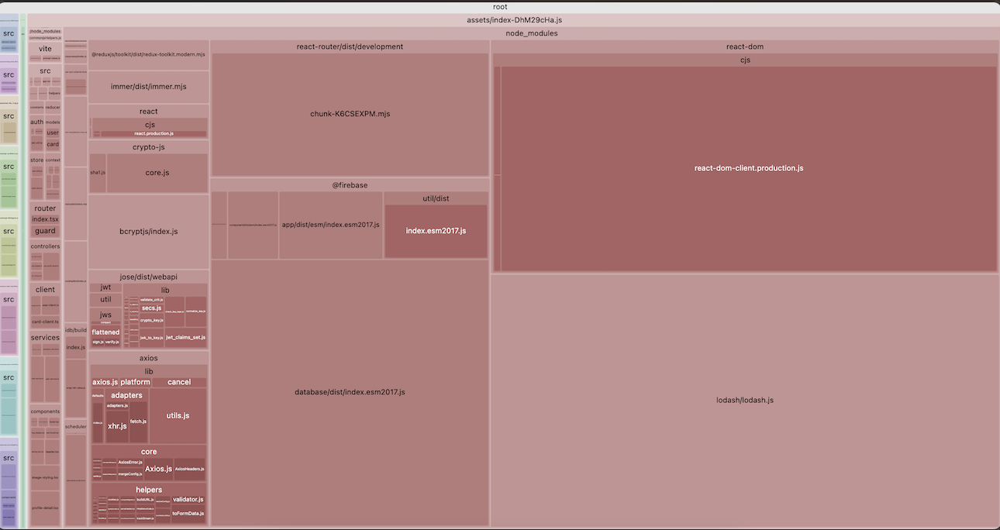
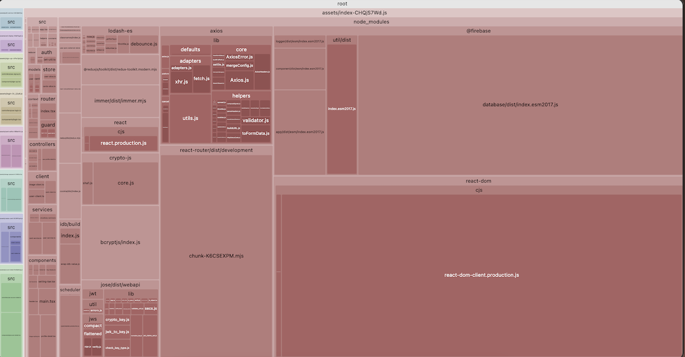

# My Business Card Project

## [Project Demo](https://mybusinesscard-ts.netlify.app/)

## Table of Contents

[1. 프로젝트 개요 (Project Overview)](#프로젝트-개요-project-overview)

[2. 프로젝트 동기 (Motivation)](#프로젝트-동기-motivation)

[3. 프로젝트 문제 및 목표 (Problems & Goal)](#프로젝트-문제-및-목표-problems--goal)

[4. 기술 스택 (Technique Stacks)](#기술-스택-technique-stacks)

[5. 코드 개선 및 리펙토링 (Code Improvement & Refactoring)](#코드-개선-및-리펙토링-code-improvement--refactoring)

- [5.1. 역할 기반 아키텍처 개선 - Client -> Service -> Controller 레이어 분리](#역할-기반-아키텍처-개선---client---service---controller-레이어-분리)

- [5.2. JWT 인증 로직 추가](#jwt-인증-로직-추가)

- [5.3. 코드 스플리팅 및 번들 크기 최적화](#코드-스플리팅-및-번들-크기-최적화)

[6. 향후 개선 사항 (Future Plans)](#향후-개선-사항-future-plans)

- [6.1. 백엔드 구현](#백엔드-구현)

- [6.2. SSR 기반으로 발전](#ssr-기반으로-발전)

## 프로젝트 개요 (Project Overview)

- **프로젝트 이름** : My Business Card (Typescript)

- **프로젝트 소개** : Firebase Realtime Database를 활용하여 실시간 데이터 저장 기반의 개인 비즈니스 카드 생성 프로젝트.

- **프로젝트 유형** : 개인 프로젝트, 토이 프로젝트

## 프로젝트 동기 (Motivation)

- 이전에 React 기반으로 진행했던 프로젝트를 타입스크립트 기반으로 리펙터링 함으로써 타입스크립트에 대한 이해를 늘리기 위함.

## 프로젝트 문제 및 목표 (Problems & Goal)

### 문제 (Problems)

**불안정한 타입**

- 동적 타이핑 언어(Dynamically Typed Language)인 자바스크립트 기반의 React 프로젝트는 변수의 타입이 안정하지 못하여 예상하지 못한 에러가 발생할 가능성이 높음.

**관심사 분리의 부재**

- 프로젝트 구조에 관하여, 논리적으로 책임에 따른 레이어가 적절하게 분리되지 않음.

### 목표 (Goals)

**코드 구조 및 디자인(UI) 개선**

- 컴포넌트 구조를 재설계함으로써 재사용성과 가독성 개선.

**번들 크기 개선**

- 코드 스플리팅 기법을 활용하여 애플리케이션 패키지를 적절하게 여러개의 번들로 나눔으로써 웹 애플리케이션 로딩시간을 단축.

## 기술 스택 (Technique Stacks)

**Front-end**

- React(Vite) + Typescript

- Tailwind CSS

- Redux, Redux Toolkit

- jose(jwt)

**Database**

- Firebase Realtime Database

**Cloud Services**

- Cloudinary API (이미지 저장)

## 코드 개선 및 리펙토링 (Code Improvement & Refactoring)

[1. 역할 기반 아키텍처 개선 - Client -> Service -> Controller 레이어 분리](#역할-기반-아키텍처-개선---client---service---controller-레이어-분리)

[2. JWT 인증 로직 추가](#jwt-인증-로직-추가)

[3. 코드 스플리팅 - 번들 최적화](#코드-스플리팅---번들-최적화)

---

### 역할 기반 아키텍처 개선 - Client -> Service -> Controller 레이어 분리

**문제점 및 개선 배경**

- 기존 JS 기반 프로젝트 아키텍처에서 역할에 따른 레이어가 적절하게 분리되지 않아 특정한 문제 발생시 오류 추적에 어려움을 겪고 유지 보수성이 떨어짐.

**개선 목표**

- 프로젝트를 역할에 따라 적절히 모듈화하여 책임에 따른 레이어로 나누어 분배함으로써 애플리케이션 안정성을 높임.

**기존 아키텍처**

- 기존 JS 기반 React 프로젝트 레이어는 Client - Controller(Hook) - Template(Component) 형태로 나누어져 있으며, 각 레이어마다 책임 분배가 적절하지 않음.

- Client 레이어는 외부 API 요청 및 API 오류와 유저의 입력값 검정(Validation) 및 데이터 가공을 담당하고 있음.

- Controller(Hook) 레이어는 비즈니스 로직과 관련된 데이터 처리 및 뷰 로직을 담당하며, 이와 관련된 예외 처리를 담당하고 있음.


**해결 방법**

- Client 레이어와 Controller 레이어 중간에 비즈니스 로직을 담당하는 Service 레이어를 배치함으로써 적절하게 책임을 분배함

**개선 후 아키텍처**

- 추가된 Service 레이어는 입력값 검증과 외부 API로부터 받은 응답데이터를 매핑(변환)하는 비즈니스 로직을 담당함.


**개선된 아키텍처의 합리성 및 타당성**

- **책임 분배**

  - 각 레이어가 담당하는 역할이 명확하게 분리되어, 에러 발생시 명확하게 파악하고 처리할 수 있음.

  - 기능 추가 및 수정시 요구사항에 따른 로직을 명확히 파악하고, 책임을 담당하는 레이어에 간단하게 추가할 수 있어 유지보수에 용이함.

- **협업 가능성**

  - 애플리케이션 구조를 [MVVM(Model-View-ViewModel)](https://github.com/kangdaelyeol/til/blob/main/book/js-react-design-pattern.md#mvvm-%ED%8C%A8%ED%84%B4)패턴의 구조로 해석할 수 있음.

  - 전형적으로 사용되는 디자인 패턴을 사용함으로써, 협업 가능성을 이끌어낼 수 있음.

    

    - **Model** : 외부 API의 요청에 따른 데이터를 다루고 비즈니스 로직을 처리하므로 API Client 및 Service 레이어와 매핑될 수 있음.

    - **View** : 데이터 처리와 관련된 로직 없이 오직 선언적 바인딩을 통해 데이터만을 표현하므로 Component(Template) 레이어와 매핑될 수 있음.

    - **ViewModel** : 뷰(View)에 바인딩될 수 있는 데이터를 구현하고, 사용자로부터 발생한 이벤트를 통해 수행할 적절한 비즈니스 로직을 결정한다. 즉, 데이터 상태(state)를 관리하고, 뷰(View)로부터 전달되는 이벤트에 대해 반응하여 로직을 수행하므로, Controller(Hook) 레이어 및 Context 레이어와 매핑될 수 있음.

    - MVVM 패턴은 도서 [JavaScript-React-Design-Patterns](https://github.com/kangdaelyeol/til/blob/main/book/js-react-design-pattern.md)을 참조

---

### JWT 인증 로직 추가

**문제점 및 개선 배경**

- 기존 JS 기반 프로젝트에서 인증이 필요한 기능에 인증로직이 적절하게 구현되지 않음. 따라서 인증 상태와 관계 없이 로직이 수행되는 보안 취약점이 존재.

**개선 목표**

- JWT 발급 및 인증 로직을 추가하여 사용자 인증이 필요한 로직이 안전하게 처리될 수 있도록 함.

**해결 방법**

- **Jose 패키지 추가**

  - Jose 패키지를 활용하여 JWT 발급 및 검증 로직 구현.

  - 서버리스(Serverless) 아키텍처 기반 프로젝트이기 때문에, 모든 로직이 클라이언트측 자바스크립트인 ESM을 기반으로 동작한다.

  - 따라서 Node.js 서버에서 사용되는 CommonJS를 기반으로하는 **jsonwebtoken** 패키지를 사용할 수 없음. 따라서 ESM 기반의 **jose** 패키지를 사용함.

- **Auth 레이어 추가**

  - 인증 로직은 외부 API를 통해 이루어지지 않으므로, Client-Service-Controller 레이어에 포함될 수 없음. 이와 독립적으로 인증 로직을 수행하는 Auth 레이어를 추가.

**개선 전 아키텍처**

- 로그인시 사용자 인증을 위한 암호화된 데이터를 저장하지 않고, 사용자 이름(username)을 인증 데이터로 로컬 스토리지(LocalStorage)에 저장. 이를 통해 사용자 데이터를 불러오기 때문에 보안에 매우 취약함.

- 사용자 인증이 필요한 API 요청시, 인증을 거치지 않고 내부 상태(State)데이터를 그대로 전송함.

  

**개선 후 아키텍처**

- **로그인 로직 개선**

  - 패스워드 비교를 위해 Auth 레이어에 [BcryptUtil](./src/auth/bcrypt-util.ts)을 추가하여 비밀번호를 안전하게 해쉬하여 비교하는 기능 구현.

  - Jose 패키지를 기반으로 [JWTUtil](./src/auth/jwt-util.ts)을 구현하여 로그인 성공시 유저 이름을 토큰화하여 저장하는 기능 수행.

  

- **라우터 가드(Router Guard) 로직 개선**

  - JWT 유틸리티 로직을 라우터 가드([guest-only](./src/router/guard/guest-only.tsx) / [logged-in-only](./src/router/guard/logged-in-only.tsx)) 컴포넌트에 추가하여 사용자 기억(Remember Me)기능 구현.

  - 인증이 필요한 특정 로직(회원 정보 수정 등) 또한 인증 레이어의 인증 과정을 거친 후 실행되도록 구현.

  

**개선 코드의 합리성 및 타당성**

- **책임 분리**

  - 인증 로직은 애플리케이션 핵심 로직(비즈니스 로직)과는 거리가 멀기 때문에, 기존 Client-Service-Controller 레이어에 포함될 수 없다. 따라서 독립적으로 Auth 레이어를 구현하여 명확하게 책임 분리를 하는 것이 타당함.

  - Auth 레이어에 포함된 모듈이 util 또는 helper등의 레이어에 포함될 수 있다. 하지만 인증과 관련된 모듈은 애플리케이션이 요구하는 핵심 비즈니스 로직과 관련이 없으므로 Auth 레이어를 따로 두어 포함하는 것이 더욱 명확하게 책임을 분리하는 것이라 판단.

---

### 코드 스플리팅 및 번들 크기 최적화

**문제점 및 개선 배경**

- 프로젝트 빌드시 번들의 크기가 커서 첫 페이지 접속시 로드 시간이 상대적으로 오래 걸림.

**개선 목표**

- 전체 프로젝트의 번들 크기를 최대한 줄이고, 코드 스플리팅 기법으로 통해 적절한 청크(Chunk)로 나누어 페이지 로드 속도를 최적화함.

**개선 이전**

- 애플리케이션에 전반적으로 사용되는 Context와 외부 패키지로 인해 매인 Chunk의 크기가 상대적으로 매우 큼.

- 번들된 외부 패키지 중 firebase, lodash, react-dom 패키지가 많은 영역을 차지하고 있음.

  

**번들 최적화 과정**

- **번들 크기 최적화 - lodash-es**

  - lodash 패키지는 CommonJS 기반 패키지이기 때문에 Webpack에 의한 번들링시 tree-shaking 기능이 작동하지 않아서 번들링 최적화가 진행되지 않음.

  - 따라서 필요한 기능만 추가하는 방법과 ESM 기반의 패키지를 추가하는 방법 중 하나를 선택하여 적용

  - **부분 가져오기(Partial/Modular import)**

    ```js
    import throttle from "lodash/throttle";
    ```

    - 필요한 기능의 부분만 따로 가져오는 방법을 사용했는데, 이는 기존 CommonJS 기반의 패키지를 사용하는 것에는 변함이 없기 때문에 불안정하므로, ESM 기반의 패키지를 추가하는 것이 더욱 타당하다 판단.

  - **lodash-es 패키지 설치** - [responsive-context.tsx](./src/context/responsive-context.tsx)

    ```js
    import { throttle } from "lodash-es";
    ```

    - ESM 기반의 패키지를 추가하여 번들러의 tree-shaking 과정을 통해 적절히 번들링 되도록 구현.

  - **최적화 결과**

    - 결과적으로 Modular Import 방식과 ESM 기반 패키지 설치 방식은 같은 크기의 번들링 최적화를 보여주었음.

    - Main Chunk 의 rendered 크기가 약 0.5MB 감소.

- **코드 스플리팅**

  - React에 내장된 lazy / Suspense 기능을 활용하여 컴포넌트를 동적으로 로드하도록 구현.

  - 각 페이지마다 연결된 다음 페이지가 존재하므로, 이동 가능한 페이지를 고려하여 동적 임포트 순서 결정

  

  - 동적 가져오기 코드는 UseEffect Hook을 활용하기 때문에 Controller훅 로직에서 처리

  - [use-login.ts](./src/controllers/use-login.ts)

    ```js
    export const useLogin = () => {
      const { setToasterMessageTimeOut } = useContext(ToasterMessageContext);

      // Dynamic Import
      useEffect(() => {
        import("@/components/main");
        import("@/components/card-display");
        import("@/components/card-editor");
        import("@/components/sign-up");
      }, []);

      // TS ...
    };
    ```

  - [use-main.ts](./src/controllers/use-main.ts)

    ```js
    export const useMain = () => {
      // Dynamic Import
      useEffect(() => {
        import("@/components/create-card");
        import("@/components/card-maker");
      }, []);

      // TS...
    };
    ```

  - [use-account-detail.ts](./src/controllers/use-account-detail.ts)

    ```js
    export const useAccountDetail = () => {
      // TS ...

      // Dynamic Import
      useEffect(() => {
        import("@/components/change-password");
      }, []);

      // TS ...
    };
    ```

- **최종 결과**

  - 메인 Chunk의 크기를 감소시킴으로써 전체 애플리케이션 번들 크기를 감소시킴.

  - 코드 스플리팅을 통해 번들을 독립 가능한 단위의 Chunk로 최대한 분리함으로써 각 페이지의 로드 속도 향상.

  

---

## 향후 개선 사항 (Future Plans)

### 백엔드 구현

**문제점**

- **인증(Auth) 레이어**

  - 현재 프로젝트는 서버리스로 구현되어있어, 사실상 백엔드에서 처리되어야 할 인증 로직이 프론트앤드 사이드에서 처리되고 있음.

  - 프론트앤드 사이드에서 처리되는 인증로직은 보안에 매우 취약하므로, 사실상 프로토타입에 불과함.

  - 또한 레이어마다 잘 구분되어 비즈니스 로직에 집중해야할 모든 프론트앤드 로직에 인증 레이어가 추가됨. 즉, 인증 로직이 추가되어 비즈니스 로직 워크 플로우가 매우 복잡해짐.

- **데이터베이스**

  - 현재 프로젝트는 서버리스로 구현되어있어, 백엔드에서 처리되어야 할 데이터베이스 로직이 프론트앤드 사이드에서 처리되고 있음.

  - firebase 데이터베이스 로직을 프론트앤드 사이드에서 처리하기 위한 firebase 패키지는 번들 크기에 상당한 부분을 차지하므로, 결과적으로 애플리케이션 로드 속도를 저하시킴.

**개선 방법**

- **백앤드 구현**

  - 서버리스 아키텍처에서 클라이언트-서버(Client-Server) 아키텍처로 변경하여, 책임 분리를 더욱 명확히 할 수 있음.

---

### SSR 기반으로 발전

**문제점**

- **번들 분할**

  - CSR 방식은 SSR방식보다 비교적 큰 자바스크립트 번들을 로드하므로, 최대한 번들을 분할하여도 페이지의 FCP, TTI 측면에서 불리함.

- **SEO**

  - JS 번들을 로드한 후 클라이언트 측에서 HTML을 동적으로 생성하므로, 크롤러가 HTML을 탐색하지 못할 경우도 있음. 따라서 SEO측면에서도 불리함.

**개선 방법**

- **SSR 기반 애플리케이션으로 발전**

  - 리엑트에서 기본적으로 제공하는 **Lazy, Suspense** 기능을 활용하여 번들을 분할해 초기 로딩 시간을 단축하였지만 한계가 있으므로, Next.js를 통한 프론트앤드 개발을 통해 성능을 향상.
